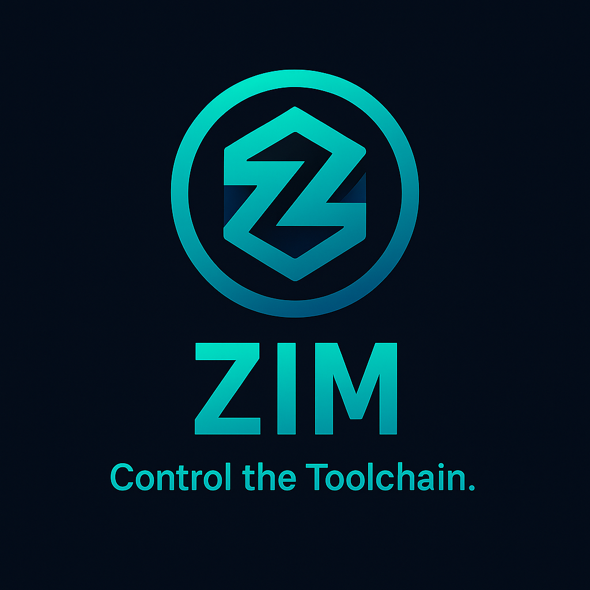

<div align="center">
  

  # 🌀 ZIM — Zig Infrastructure Manager

  **The all-in-one toolchain and package manager for Zig**

  [](LICENSE)
  [](https://ziglang.org)
  [](https://github.com/ghostkellz/zim)
</div>

---

**ZIM** is the next-generation **toolchain and package manager for Zig**, unifying what `rustup` and `cargo` do for Rust into one cohesive tool — written entirely in Zig.

It's fast, portable, and designed to be the **core infrastructure for the modern Zig ecosystem**, powering reproducible builds, dependency resolution, cross-compilation, and secure toolchain management — all in one binary.

---

## 🚀 Mission

> To make **Zig development frictionless, reproducible, and secure** — from local development to production deployment.

ZIM eliminates fragmented workflows by merging **toolchain and dependency management** into one cohesive system that's secure, fast, and ready for cross-compilation to any target.

---

## ✨ Core Features

### 🔧 Toolchain Management (like `rustup`)
- **Install multiple Zig versions** side-by-side with cryptographic verification
- **System Zig detection** — automatically detect and use system-installed Zig (anyzig-style)
- **Global and per-project pinning** — set active version globally or via `.zim/toolchain.toml`
- **Automatic toolchain detection** — respects project-specific Zig versions
- **Verified downloads** — SHA-256 hash verification using zcrypto
- **ZLS management** — install, configure, and manage Zig Language Server

### 📦 Dependency Management (like `cargo`)
- **Multiple dependency sources:** Git repositories, tarballs, local paths, GitHub shorthand, and registries (future)
- **GitHub shorthand syntax:** `gh/owner/repo[@ref]` for easy GitHub dependencies
- **Semantic versioning** with npm-style constraints (`^1.2.3`, `~1.0.0`, `>=2.0.0`, `1.0.0...2.0.0`)
- **Content-addressed caching** — Babylon-inspired deduplication and efficiency
- **Advanced dependency resolution** — automatic conflict detection, transitive dependencies, and circular dependency detection
- **Dependency graph visualization** — Beautiful ASCII tree with cycle indicators
- **Reproducible builds** — deterministic lockfiles (`zim.lock`) with full provenance tracking
- **Native Zig format support** — read and write `build.zig.zon` dependencies
- **Policy engine** — Allow/deny lists, hash requirements, and audit reports

### 🌐 Cross-Compilation Support
- **Target management** — add and manage cross-compilation targets
- **Common targets:** `x86_64-linux`, `aarch64-linux`, `wasm32-wasi`, `x86_64-windows`, `aarch64-macos`
- **Stdlib bundled** — Zig's stdlib works out-of-the-box for all targets
- **Custom sysroots** — optional custom headers and libraries per target

### 🔐 Security & Integrity
- **Hash verification** — all downloads verified with SHA-256 checksums
- **Integrity checks** — `zim verify` ensures dependency integrity
- **Secure by default** — uses system CA certificates for HTTPS
- **Future:** Package signing and attestation support

### 🚀 Developer Experience
- **Beautiful CLI** — clear, colorful output with progress indicators
- **Dependency visualization** — ASCII tree graphs with cycle detection (↻ for cycles)
- **Smart caching** — content-addressable storage prevents duplication
- **Comprehensive diagnostics:**
  - `zim doctor` — System health check (Zig, cache, config, network, disk)
  - `zim doctor workspace` — Manifest/lockfile drift detection
  - `zim cache integrity` — Cache corruption detection
- **Self-update mechanism** — `zim update` keeps ZIM up-to-date
- **Policy enforcement** — `zim policy audit` validates dependencies
- **Comprehensive docs** — full CLI and API documentation

---

## 📁 Directory Structure

```
~/.zim/
├── toolchains/           # Installed Zig versions
│   ├── 0.16.0/          # Zig 0.16.0 installation
│   ├── 0.13.0/          # Zig 0.13.0 installation
│   └── active           # Symlink to active version
├── targets/             # Cross-compilation targets
│   ├── wasm32-wasi/     # WASM target sysroot (optional)
│   └── aarch64-linux/   # ARM64 Linux sysroot (optional)
└── config/              # Global configuration
    └── config.toml      # ZIM configuration

~/.cache/zim/
└── deps/                # Content-addressed dependency cache
    ├── ab/cd/abcdef...  # Cached dependency (hash-based)
    └── 12/34/123456...  # Another cached dependency
```


---

## 🚀 Installation

### Quick Install

```bash
# Clone and build from source
git clone https://github.com/ghostkellz/zim.git
cd zim
zig build
./zig-out/bin/zim --version
```

### Integration with Existing Projects

Add ZIM to your project's dependencies using Zig's native package manager:

```bash
# Using zig fetch
zig fetch --save https://github.com/ghostkellz/zim/archive/main.tar.gz

# Or clone directly
git clone https://github.com/ghostkellz/zim.git
```

Then in your `build.zig.zon`:

```zig
.dependencies = .{
    .zim = .{
        .url = "https://github.com/ghostkellz/zim/archive/main.tar.gz",
        .hash = "1220...", // Hash from zig fetch
    },
},
```

### System Package Installation

See [Installation Guide](#installation-guide) for OS-specific packages (Arch, Debian, Ubuntu, Fedora).

---

## ⚡ Quick Start

```bash
# Install Zig 0.16.0
zim install 0.16.0

# Set as global active version
zim use 0.16.0

# Or use system-installed Zig (if available)
zim use system

# Check current active Zig version
zim toolchain current

# Setup ZLS (Zig Language Server)
zim zls doctor              # Check ZLS installation and health
zim zls config              # Generate optimal ZLS configuration
zim zls info                # Show ZLS version and info

# Initialize a new project
zim deps init my-awesome-project
cd my-awesome-project

# Add dependencies (multiple formats)
zim deps add zsync --git https://github.com/ghostkellz/zsync --ref main
zim deps add zhttp gh/ghostkellz/zhttp@main          # GitHub shorthand
zim deps add zpack gh/hendriknielaender/zpack@v0.3.3 # Specific version

# Fetch all dependencies
zim deps fetch

# View dependency tree with cycle detection
zim deps graph

# Run diagnostics
zim doctor                # Full system check
zim doctor workspace      # Check manifest/lockfile sync
zim cache integrity       # Verify cache health

# Policy enforcement
zim policy audit          # Check dependencies against policy

# Self-update ZIM
zim update

# Add cross-compilation target
zim target add wasm32-wasi

# Verify project integrity
zim verify

# Build your project
zig build
```

---

## 📝 Configuration Examples

### Project Configuration: `.zim/toolchain.toml`

Pin your project to a specific Zig version:

```toml
# ZIM toolchain configuration
zig = "0.16.0"

# Cross-compilation targets
targets = ["x86_64-linux-gnu", "wasm32-wasi"]
```

### Dependency Manifest: `zim.toml`

Define your project dependencies:

```toml
[project]
name = "my-awesome-project"
version = "1.0.0"
zig = "0.16.0"

[dependencies]
zsync = { git = "https://github.com/ghostkellz/zsync", ref = "main" }
zhttp = { git = "https://github.com/ghostkellz/zhttp", ref = "main" }
zpack = { tarball = "https://example.com/zpack.tar.gz", hash = "sha256:abc123..." }

[dev-dependencies]
test-framework = { git = "https://github.com/user/test", ref = "v1.0.0" }

[targets]
default = ["native", "wasm32-wasi"]
```

### Global Configuration: `~/.config/zim/config.toml`

Configure ZIM globally:

```toml
[cache]
dir = "/custom/cache/dir"
max_size = 10737418240  # 10GB

[registry]
url = "https://zim.example.com/registry"
mirror = "https://mirror.example.com"

[policy]
require_signatures = true
allowed_sources = ["github.com", "gitlab.com"]

[network]
ca_bundle = "/etc/ssl/certs/ca-bundle.crt"
```

---

## 📚 Documentation

- **[CLI Reference](docs/CLI.md)** — Complete command-line documentation
- **[API Documentation](docs/API.md)** — Full API reference for all modules
- **[Configuration Guide](docs/CONFIGURATION.md)** — Detailed configuration options
- **[Examples](examples/)** — Example projects and use cases

---

## 🛠️ Tech Stack

- **Language:** Zig 0.16.0+
- **Parser:** zontom (TOML parsing)
- **HTTP:** zhttp (downloads)
- **Crypto:** zcrypto (hash verification)
- **Compression:** zpack (archive extraction)
- **Git:** Native git integration for dependencies

### Ghost Stack Integration

ZIM leverages the entire **Ghost Stack** ecosystem of 15 high-quality Zig libraries:

- **zhttp** — HTTP client for downloads
- **zcrypto** — Cryptographic verification
- **zontom** — TOML parsing
- **zpack** — Archive handling
- **zsync** — Synchronization primitives
- **flash** — Fast algorithms
- **flare** — Event systems
- And more...

---

## 🧭 Roadmap

### ✅ Milestone 0.1 — Core Features (Current)

- ✅ Toolchain management (install, use, pin)
- ✅ Dependency management (add, fetch, graph)
- ✅ Content-addressed caching
- ✅ Semantic versioning with constraints
- ✅ Hash verification
- ✅ Cross-compilation targets
- ✅ Dependency resolution with conflict detection
- ✅ Git dependency support
- ✅ build.zig.zon integration

### 🚧 Milestone 0.2 — Polish & Package Registry

- 🚧 Public package registry
- 🚧 Workspace/monorepo support
- 🚧 Parallel downloads with progress bars
- 🚧 Mirror support for offline builds
- 🚧 Enhanced cache management
- 🚧 Performance optimizations

### 📋 Milestone 0.3 — Advanced Security

- 📋 Package signature verification
- 📋 SBOM (Software Bill of Materials) generation
- 📋 Provenance tracking
- 📋 Policy enforcement
- 📋 Attestation logs

### 🔮 Future

- WASM runtime integration
- CI/CD bootstrap commands
- Metrics and telemetry
- Advanced policy controls

---

## 🧠 Philosophy

**Reproducibility First:** Every build is tied to a specific Zig version and dependency state via lockfiles.

**Security by Default:** All downloads are verified. Hash mismatches automatically delete corrupted files.

**Developer Experience:** Beautiful CLI output, comprehensive docs, and helpful error messages.

**Performance:** Written in Zig, statically linked, portable, and blazingly fast.

**Composability:** Works seamlessly with the entire Ghost Stack ecosystem.

---

## 🤝 Contributing

We welcome contributions! Please see [CONTRIBUTING.md](CONTRIBUTING.md) for guidelines.

### Development Setup

```bash
# Clone repository
git clone https://github.com/ghostkellz/zim.git
cd zim

# Build
zig build

# Run tests
zig build test

# Run ZIM
./zig-out/bin/zim --help
```

---

## 📜 License

MIT License - see [LICENSE](LICENSE) for details.

---

## 🙏 Acknowledgments

- **Zig Team** — For creating an amazing language
- **Ghost Stack** — For the high-quality Zig libraries
- **Babylon** — Inspiration for content-addressed caching
- **Cargo & Rustup** — Design inspiration for package and toolchain management

---

<div align="center">

## 🌟 ZIM — The missing link in the Zig toolchain

**[Install Now](#installation) • [Documentation](docs/) • [Report Issue](https://github.com/ghostkellz/zim/issues) • [Contribute](#contributing)**

</div>

